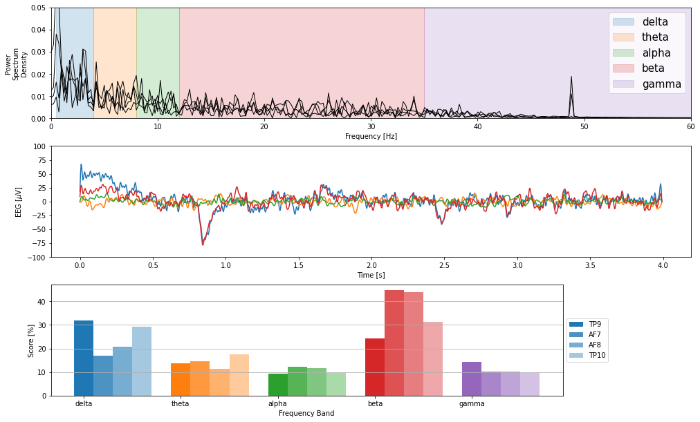

## MuseController

Code based from Alexandre Barachant's [https://github.com/alexandrebarachant/muse-lsl] to acquire eeg data.

Table of contents:

- [MuseController](#musecontroller)
  - [1. Installation](#1-installation)
  - [2. Data acquisition](#2-data-acquisition)
  - [3. Preprocessing](#3-preprocessing)
  - [4. Training](#4-training)
  - [5. MindMonitor Plotting](#5-mindmonitor-plotting)
  
## 1. Installation 
1. Create a conda environment from the muse.yml file and install the dependencies.

    ```bash
    $ conda env create --name muse --file=muse.yml

    ```
## 2. Data acquisition
1. Change the desired values in the data_gathering.py file.

2. Activate the conda environment and run the data_gathering.py file, where "--r 10" is the argument for the number of repetitions (default: 8 classes and 10 repetitions = 80 samples)

    ```bash
    $ conda activate muse
    $ (muse) python data_gathering.py --r 10
    ```
3. Verify that the generated files are under ./2-Data/1-RawData/visual_gaze/local/muse2/subject####/session###

## 3. Preprocessing 
1.  Run the preprocess_data.py file.

    ```bash
    $ conda activate muse
    $ (muse) python preprocess_data.py
    ```
## 4. Training
1. Train the Neural net model under ./utils/models.py

## 5. MindMonitor Plotting
1. Import files and plot different stats with the MindMonitorViewer.ipynb



## Muselsl library from:
Alexandre Barachant, Dano Morrison, Hubert Banville, Jason Kowaleski, Uri Shaked, Sylvain Chevallier, & Juan Jesús Torre Tresols. (2019, May 25). muse-lsl (Version v2.0.2). Zenodo. http://doi.org/10.5281/zenodo.3228861